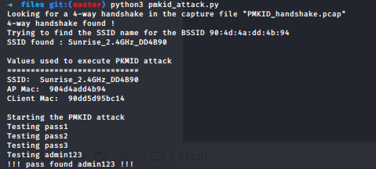
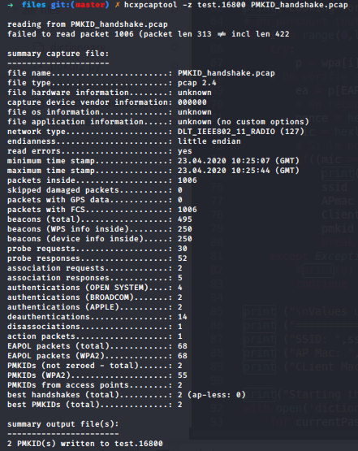
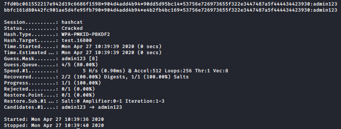

# SWI - Labo 5 - Attaque PMKID 

## Auteurs : Daniel Oliveira Paiva et Edin Mujkanovic

### Script attaque PMKID  : 

Le script se trouve dans le dossier`files` situé à la racine du projet. Il utilise les fichiers `dictionnary` comme dictionnaire, `PMKID_handshake.pcap` comme fichier contenant les trames et `pbkdf2.py` comme librairie.

Ci-dessous, une capture d'écran de exécution de notre script : 

**NOTE : ** Durant le développement du script, nous avons essayé d'utiliser `haslayer()` sur le paquet mais cela n'a pas fonctionné. En effet, nous recevions un message comme quoi cette méthode n'existait pas. Afin de contourner ceci, et garder le script dynamique, nous avons du entourer nos différentes méthodes de `try/except` et de forcer la récupération des layers `EAPOL` et `Dot11` en utilisant `ea = p[EAPOL]`. Si le paquet contient le layer souhaité, le script continue normalement, sinon, il passe dans l'except et passe au paquet suivant. Cela n'est pas très propre mais c'est le seul moyen que nous avons trouvé afin de garder le script dynamique pour n'importe quel fichier de capture en entrée. 

### Hashcat : 

Ci-dessous, une capture d'écran de l'attaque PMKID avec l'outil hashcat : 

**Formatage du fichier :**

**Execution hashcat** :

Nous avons utilisé le même dictionnaire que pour le script. En effet, vu que nous travaillons dans une machine virtuelle, il nous était impossible de faire du brute-force ou même d'utiliser la wordlist `rockyou` par manque de performance.